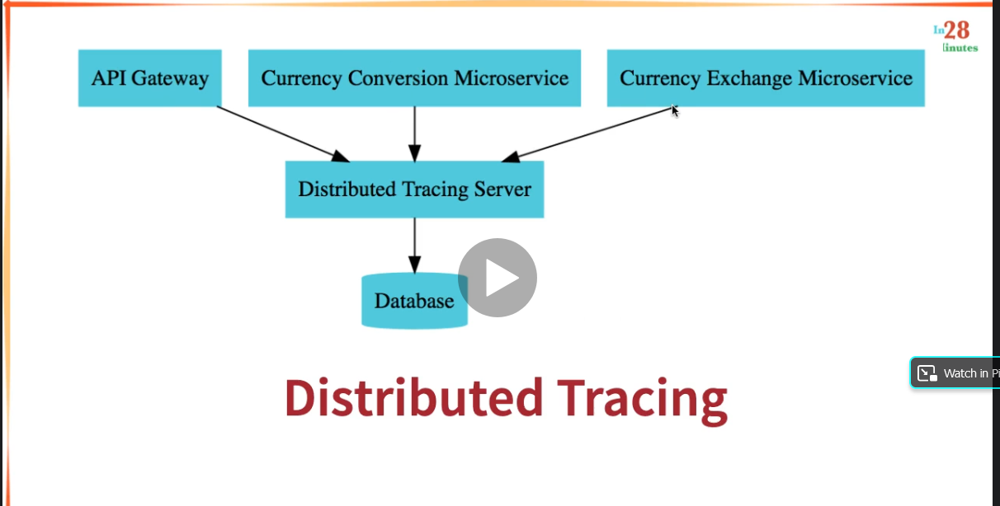

# api-gateway
Project to implement Spring Cloud Gateway instead of Zuul, for UDEMY Microservices Course

# Ports Standarization


# Initial structure of the project


# Spring Cloud Gateway to use the same common configuration between microservices
- In a typical Microservices architecture there are a lot of microservices (hundreds, thousands)
- A lot of them share common configurations
- Spring Cloud API Gateway does that work for you
    - In Earlier versions of Spring was called Zuul

Is registered automatically in Eureka, but to be sure, you can configure the properties file
``eureka.client.serviceUrl.defaultZone = http://localhost:8761/eureka``


# Enable the ability to discover microservices talking with EUREKA and using the name convention in Eureka http://localhost:8761 (e.g) CURRENCY-EXCHANGE
```spring.cloud.gateway.discovery.locator.enabled = true``` 
 
Allows to talk With Eureka and use the name of the application to go to the service through the name registered
e.g

Original URL --> ``http://localhost:8100/currency-conversion-feign/from/USD/to/MXN/quantity/10``

Using Spring Gateway --> ``http://localhost:8765/CURRENCY-EXCHANGE/currency-exchange/from/USD/to/MXN``

To avoid the upper case in the url add the following to properties

``spring.cloud.gateway.discovery.locator.lowerCaseServiceId = true``

Then...
Original URL --> ``http://localhost:8100/currency-conversion-feign/from/USD/to/MXN/quantity/10``

Using Spring Gateway --> ``http://localhost:8765/currency-exchange/currency-exchange/from/USD/to/MXN``


# Distributed Tracing (Zipkin Server)
- ¿How you can trace a request tha travels across a lot of Microservices?
  - Using Distributed Tracing 



# Setting up Zipkin Server with Docker
``docker run -p 9411:9411 openzipkin/zipkin:2.23``
- That will pull or run that specific image of Zipkin Server in a Docker container.
- Go to ``http://localhost:9411/zipkin/`` the server will be up and running.

- Configure in the project the following dependencies:
```
    <dependency>
      <groupId>org.springframework.cloud</groupId>
      <artifactId>spring-cloud-starter-sleuth</artifactId>
    </dependency>
```

This library helps to assign an id per request

```
    <dependency>
      <groupId>org.springframework.cloud</groupId>
      <artifactId>spring-cloud-sleuth-zipkin</artifactId>
    </dependency>
```

This one adds Zipkin

```
  <dependency>
    <groupId>org.springframework.amqp</groupId>
    <artifactId>spring-rabbit</artifactId>
  </dependency>
```

Optional, this is for the AMQP and RabbitMQ and keep the requests in the queue, in this way if the Zipkin server is down, we are not loosing the information of the requests.


# Configuring Sampling
This allows to analyze a percentage of the requests as sampling

in properties file (1.0 means 100% of the requests)
``spring.sleuth.sampler.probability = 1.0``

Run the microservice, Zipkin, send a request and Refresh Zipkin in browser
